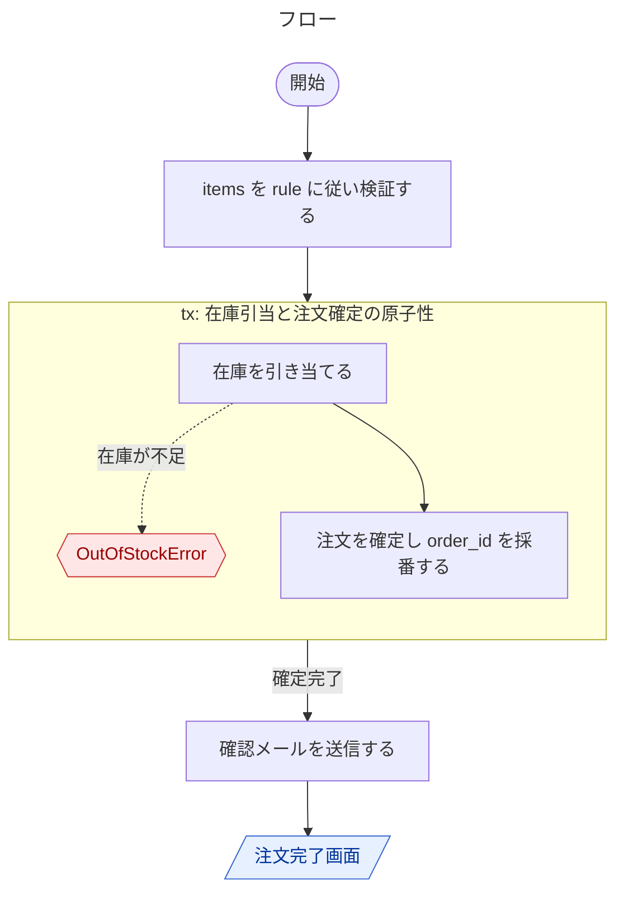
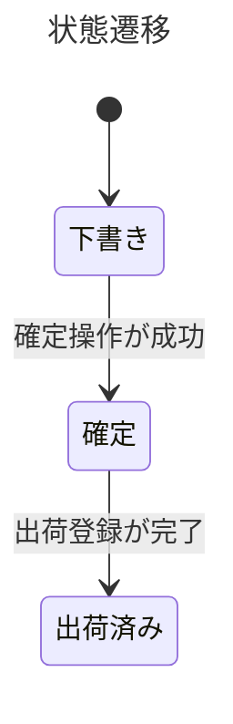

---
spec_runner:
  node_id: 詳細.ユースケース.注文確定
  kind: detailed_design
  depends_on: []
  maps_to: []
---

```yaml
概要:
  title: UC-注文確定
  purpose: 注文を検証し確定する

入出力:
  inputs:
    - name: items
      desc: 注文明細
  exceptions:
    - type: OutOfStockError
      cond: 在庫が不足

状態:
  - 状態一覧: [下書き, 確定, 出荷済み]
    遷移:
      - { from: 下書き, to: 確定, when: 確定操作が成功 }
      - { from: 確定, to: 出荷済み, when: 出荷登録が完了 }

フロー:
  - step: 1
    do: items を rule に従い検証する
  - step: 2
    tx: 在庫引当と注文確定の原子性
    body:
      - do: 在庫を引き当てる
        error: 在庫が不足 -> OutOfStockError
      - do: 注文を確定し order_id を採番する
  - step: 3
    on: 確定完了
    do: 確認メールを送信する
    next: 注文完了画面

テスト仕様:
  - id: T-01
    type: 結合
    case: 正常な items で注文が確定する
  - id: T-02
    type: 結合
    case: 在庫不足で OutOfStockError
    covers: [exceptions.在庫が不足]
```

<!-- spec-runner:figure:start -->

## 図（自動生成・編集禁止）



---



<!-- spec-runner:figure:end -->
