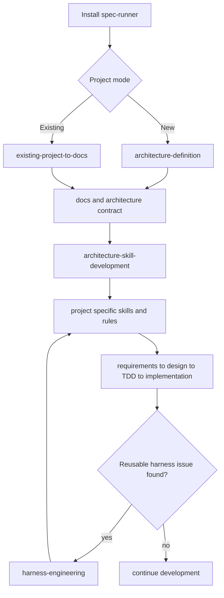
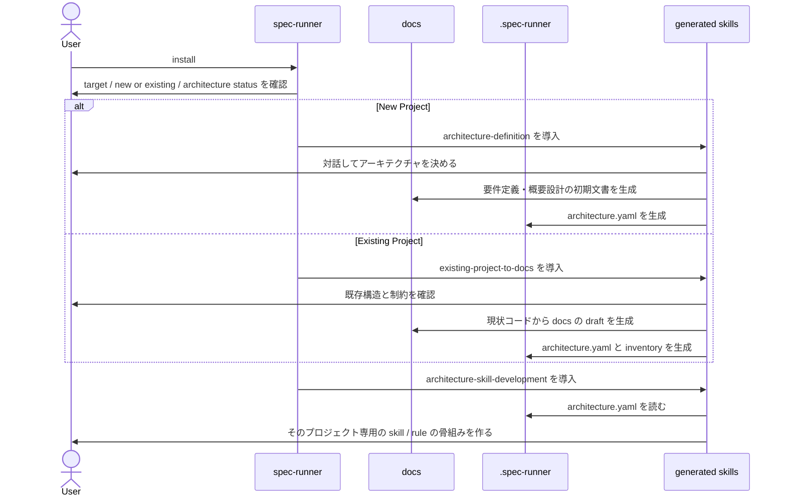
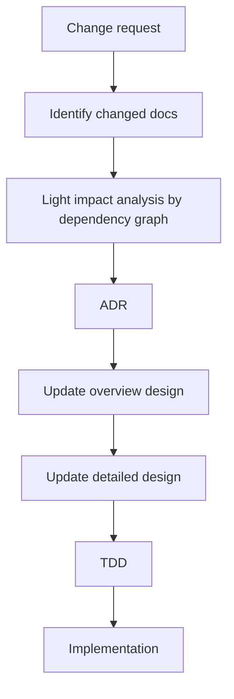

# spec-runner ハーネスエンジニアリング構想

## 目的

`spec-runner` の目的は、AI 開発運用のための rules / agents / skills を配ることではなく、
**ドキュメントを正本として開発を進める運用基盤をプロジェクトへ導入すること**
に置く。

この構想では、次を満たしたい。

- `docs/` を人間向けの正本にする
- `要件定義 -> 概要設計 -> 詳細設計 -> TDD -> 実装` の流れを持つ
- skill はテンプレートを持ち、それをコピーして内容を埋めていく
- 新規プロジェクトと既存プロジェクトの両方に導入できる
- アーキテクチャごとに固定の skill pack を配るのではなく、
  **人間と AI が決めたアーキテクチャに沿って、そのプロジェクト専用の skill を作る**

## 基本方針

### 1. docs は人間向けの正本

`docs/` には人間が読むための設計書を置く。

- `01_要件定義`
- `02_概要設計`
- `03_詳細設計`

この 3 層が、開発プロセスの主線になる。

### 2. `.spec-runner/` は AI 向けの補助情報

AI が安定して動くための補助情報は `.spec-runner/` に置いてよい。

例:

- アーキテクチャの構造化情報
- 依存グラフの派生キャッシュ
- 既存システム解析結果

ここは人間向けの正本ではなく、AI が読むための補助層とする。

### 3. 概要設計は「何をするか」を厚く持つ

`docs/02_概要設計` には、一覧だけでなく、
**ユースケースごとに何をするかを説明する文書群** を持たせる。

ここで扱うもの:

- ユースケース一覧
- システム全体俯瞰
- ドメイン責務
- 外部IF
- 非機能・運用方針
- ユースケース個別文書
- ADR

概要設計は、要件定義と詳細設計の間にある「何をするか」の層として厚めに持つ。

### 4. `docs/03_詳細設計` は `src/` と対応させる

完全に同じ木構造にすることを強制する必要はないが、
**詳細設計は原則として `src/` と決定的に対応づける**。

つまり:

- 要件定義と概要設計は上位文書
- 詳細設計は実装構造に寄せる

これにより、`ドキュメント = コード` を実務上成立させる。

### 5. 命名規則は層ごとに分ける

人間向け文書と `src/` 対応文書では、命名規則を分ける。

- `docs/01_要件定義`, `docs/02_概要設計` は日本語中心
- `docs/03_詳細設計` は `src/` に寄せて英語 `snake_case`
- 文書本文の見出しや説明文は日本語でよい

### 6. ADR は概要設計側に置く

ADR は「なぜそう決めたか」の履歴であり、
「今どう実装するか」を表す詳細設計とは役割が異なる。

そのため、ADR は原則として `docs/02_概要設計/` 配下に置く。

- 全体 ADR: `docs/02_概要設計/90_ADR/`
- ドメインローカル ADR: `docs/02_概要設計/<ドメイン>/90_ADR/`

MVP では、まず `docs/02_概要設計/90_ADR/` に集約してよい。

### 7. 依存関係の正本は docs に書く

依存関係は、`docs` と `.spec-runner/` の両方に手で書かない。

正本は `docs` に置き、
`.spec-runner/graph/` はそこから生成される派生キャッシュとする。

各文書には、本文とは分けて最小限の frontmatter を持たせる。

- `node_id`
- `kind`
- `depends_on`
- `maps_to`

必要なら、次の拡張を許してよい。

- `depends_on[].relation`
- `modules`
- `source_files`

ただし、MVP の正本はあくまで上の 4 項目とし、
拡張項目は `maps_to` と矛盾させない。

これにより、
`ドキュメント = コード` の考えを崩さずに依存グラフを維持できる。

### 8. 依存グラフは影響範囲の候補を出すために使う

依存グラフは、変更時に
**「どの文書・コード・テストを見直すべきか」**
を洗い出すための地図である。

ただし、依存グラフが分かるのは
**宣言された依存関係と抽出できた依存関係の範囲** であり、
現実の全てを完全に保証するものではない。

つまり:

- 完全な真実を表すものではない
- しかし、漏れ防止には非常に強い
- 人間と AI が影響範囲を追うための基盤として有効

### 9. TDD は skill 自体の検証ではない

TDD は、AI が生成・修正する**アプリケーションコードの品質を上げるための規律**である。
skill 自体に対して TDD を行う、という意味ではない。

## 目指す全体像



## 推奨ディレクトリ構成

```text
<project-root>/
├── docs/
│   ├── 01_要件定義/
│   │   └── 要件定義.md
│   ├── 02_概要設計/
│   │   ├── ユースケース一覧.md
│   │   ├── システム全体俯瞰.md
│   │   ├── ドメイン責務マップ.md
│   │   ├── 外部IF一覧.md
│   │   ├── 非機能・運用方針.md
│   │   ├── 90_ADR/
│   │   │   └── ADR-0001-docs-as-code.md
│   │   └── ユースケース/
│   │       └── 突合チェック/
│   │           └── UC-差異一覧表示.md
│   └── 03_詳細設計/
│       └── src/
│           ├── agents/
│           │   └── reconciliation/
│           │       ├── agent.md
│           │       ├── domain.md
│           │       ├── prompts.md
│           │       └── config.md
│           └── plugins/
│               ├── skills/
│               │   └── design_change/
│               │       └── skill.md
│               └── tools/
│                   └── search/
│                       └── tool.md
├── src/
│   ├── agents/
│   └── plugins/
├── tests/
├── .spec-runner/
│   ├── architecture/
│   │   └── architecture.yaml
│   ├── graph/
│   │   ├── nodes.jsonl
│   │   └── edges.jsonl
│   └── intake/
│   │   └── current-system-inventory.md
├── .claude/
└── .github/
```

## docs と code の関係

### 要件定義

- 何を解決するか
- 誰に何を提供するか
- 制約とスコープ

### 概要設計

- ユースケース一覧
- ユースケース個別文書
- システム全体俯瞰
- ドメイン境界
- ドメイン責務マップ
- 外部IF一覧
- 非機能・運用方針
- 採用アーキテクチャ
- ADR

### 詳細設計

- `src/` に対応する設計
- エージェント / スキル / ツール / インフラの具体設計

要件定義では「なぜ作るか」を整理し、
概要設計では「何をするか」を整理し、
詳細設計では「どう作るか」を `src/` に寄せて整理する。

## 依存グラフ

### 依存関係とは何か

依存関係とは、
**A が変わったとき、B を見直す必要がある**
という関係である。

このプロジェクトでは、コードの import だけでなく、
成果物全体の依存を扱う。

例:

- 要件定義 → 概要設計
- 概要設計 → ユースケース個別文書
- 概要設計 / ADR → 詳細設計
- 詳細設計 → `src/`
- 詳細設計 → `tests/`

### どこに持つか

依存の正本は `docs` の frontmatter に持つ。
全体グラフは `.spec-runner/graph/` に派生生成する。

```yaml
---
spec_runner:
  node_id: use_case.reconciliation.list
  kind: use_case
  depends_on:
    - overview.usecases
    - overview.system_context
  maps_to:
    - src/agents/reconciliation/agent.py
    - tests/agents/reconciliation/test_agent.py
---
```

### 何に使うか

- `design-change` で影響ドキュメントを洗い出す
- `existing-project-to-docs` で docs と code の対応を残す
- `architecture-skill-development` で skill の粒度を決める
- 変更時に修正候補を漏れにくくする

### 変更要求が来たときの使い方

変更要求に対しては、いきなり ADR を始めるのではなく、
まず軽い影響調査を行う。

流れ:

1. 変更要求を受ける
2. 変更起点の docs を特定する
3. 依存グラフで影響候補を軽く洗う
4. その結果を前提に ADR を作る
5. 方針決定後に詳細な設計修正と実装へ進む

ここでの影響調査は、
実装詳細まで掘るためのものではなく、
**ADR の前提となるスコープ確認** を目的とする。

### 限界

依存グラフがあっても、
影響範囲を完全に自動判定できるわけではない。

理由:

- docs が古ければ依存情報も古くなる
- 暗黙知はグラフに乗らない
- 実行時だけ現れる結合は拾いにくい
- ビジネス判断の波及は人間確認が必要

そのため、依存グラフは
**影響範囲の完全保証** ではなく、
**影響候補の高精度な列挙** として使う。

## ADR の置き場所

ADR は原則として概要設計側に置く。

理由:

- ADR は設計判断の履歴である
- 詳細設計は現在の実装構造を表す
- 両者を混ぜると、判断履歴と現行設計の境界が曖昧になる

推奨:

- 全体判断は `docs/02_概要設計/90_ADR/`
- 特定ドメインの判断は `docs/02_概要設計/ユースケース/<ドメイン>/90_ADR/`

MVP では、まず全て `docs/02_概要設計/90_ADR/` に集約する。

## インストール時のフロー案

インストール時には、`Claude / Copilot / Both` だけでなく、
**新規導入か既存導入か** を必ず選ばせる。

### 入口で選ぶ項目

1. install target
   - Claude
   - Copilot
   - Both
2. project mode
   - New Project
   - Existing Project
3. architecture status
   - 未決定
   - 既に決まっている

### フロー



## 新規導入時にやること

### 1. アーキテクチャを定義する

最初に必要なのは fixed pack の選択ではなく、
人間と AI が対話してアーキテクチャを決めることである。

ここで決めるもの:

- システム境界
- ドメイン分割
- 実装単位
- エージェント / プラグインの責務
- インフラ方針
- TDD の適用単位

### 2. 決定内容を 2 つの形で残す

- `docs/` に人間向けの設計書を残す
- `.spec-runner/architecture/architecture.yaml` に AI 向けの設計契約を残す

### 3. その決定から project 専用 skill を作る

ここで初めて、アーキテクチャに沿った skill を作る。

重要なのは、
**アーキテクチャごとの skill pack を事前に大量に持つのではなく、
決めたアーキテクチャから、その project 専用の skill を生成する**
という点である。

## 既存導入時にやること

既存プロジェクトでは、先に docs がないことが多い。
そのため、入口は architecture selection ではなく、
**現状コードから docs を起こすこと** になる。

### 1. 既存コードを読む

対象:

- `src/`
- `tests/`
- 設定ファイル
- インフラ定義
- README や既存メモ

### 2. docs の draft を作る

生成するもの:

- 要件定義の draft
- 概要設計の draft
  - ユースケース一覧
  - ユースケース個別文書
  - システム全体俯瞰
  - ドメイン責務
  - ADR 候補
- 詳細設計の draft

### 3. 現状アーキテクチャを構造化する

`.spec-runner/architecture/architecture.yaml` に、
現状システムのアーキテクチャを構造化して保存する。

### 4. その内容から project 専用 skill を作る

以後は新規導入時と同じで、
構造化されたアーキテクチャ情報を元に skill を作る。

## 変更要求に対する標準フロー

変更要求が入ったときの標準フローは次の通り。



ポイント:

- ADR の前に軽い影響調査を行う
- 影響調査は、案の比較に必要な前提を揃えるために行う
- ADR 決定後に、詳細な設計修正と TDD に入る

## 必要な skill の案

### 共通でインストールする基盤 skill

- `test-driven-development`
  - アプリケーションコードの品質を上げるための TDD
- `design-change`
  - 既存仕様変更時のフロー
- `harness-engineering`
  - skills / rules / templates 自体の改善

### 新規導入で使う skill

- `architecture-definition`
  - 人間と AI の対話でアーキテクチャを決める
  - 要件定義 / 概要設計の初期文書を作る

### 既存導入で使う skill

- `existing-project-to-docs`
  - 既存コードを読み、docs の draft を作る
  - 現状アーキテクチャを抽出する

### アーキテクチャ決定後に使う skill

- `architecture-skill-development`
  - 決定済みアーキテクチャに沿って、
    project 専用の skill / rule / template を作る

## `plugin-development` の位置づけ

現状の `plugin-development` は、
今すぐ使える新規開発 skill ではあるが、
構想上は最終形ではない。

今後の位置づけとしては次のどちらかがよい。

1. 現行の reference implementation として残す
2. `architecture-skill-development` が生成する skill の元テンプレート群として再利用する

つまり、`plugin-development` を唯一の普遍 skill にするのではなく、
**project 専用 skill を生成するための種** に寄せるほうがよい。

## 生成されるものの最小例

### 1. AI 向けの設計契約

```yaml
# .spec-runner/architecture/architecture.yaml
architecture_name: plugin-based-agent-system
domain_structure:
  - accounting
  - reconciliation
runtime_units:
  - agents
  - plugins.skills
  - plugins.tools
design_policy:
  detailed_design_mirrors_src: true
  tdd_required_for_application_code: true
```

### 2. docs の frontmatter 例

```yaml
---
spec_runner:
  node_id: detail.agent.reconciliation
  kind: detailed_design
  depends_on:
    - use_case.reconciliation.list
    - adr.detailed_design_mirrors_src
  maps_to:
    - src/agents/reconciliation/agent.py
    - tests/agents/reconciliation/test_agent.py
---
```

### 3. 生成される project 専用 skill

```md
---
name: project-development
description: このプロジェクトの採用アーキテクチャに沿って、要件定義から詳細設計、TDD、実装まで進める。
---

# project-development

## 原則

- 要件定義、概要設計、詳細設計を順番に進める
- `docs/03_詳細設計` は `src/` に対応させる
- 実装前に `test-driven-development` に従って失敗するテストを書く
```

### 4. 生成される詳細設計の例

```text
docs/03_詳細設計/src/agents/reconciliation/
├── agent.md
├── domain.md
├── prompts.md
└── config.md
```

### 5. 生成される ADR の例

```text
docs/02_概要設計/90_ADR/
└── ADR-0001-detailed-design-mirrors-src.md
```

## MVP のすすめ方

最初から全自動化しないほうがよい。

1. install 時に `new / existing` を選べるようにする
2. `architecture-definition` を作る
3. `existing-project-to-docs` を作る
4. `architecture-skill-development` を作る
5. `plugin-development` を生成テンプレートの種として整理する
6. 最後に `harness-engineering` で skill 改善の運用を整える

## 一言でいうと

`spec-runner` は、
**「決まった skill pack を入れる道具」ではなく、
「人間と AI が決めたアーキテクチャから、そのプロジェクト専用の開発 skill を立ち上げる道具」**
として設計するのがよい。
