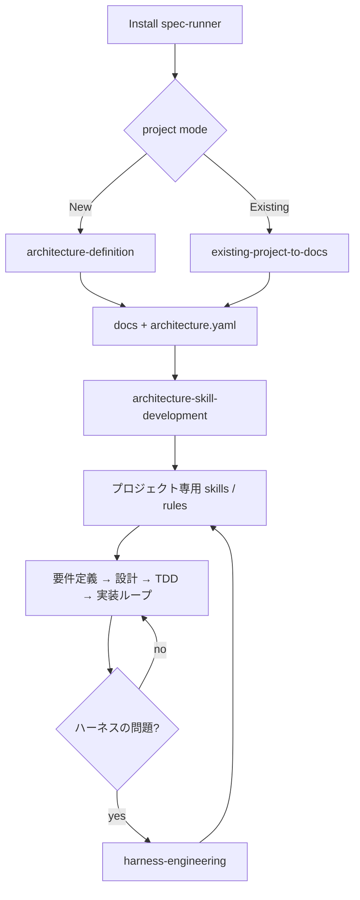

# spec-runner ハーネスエンジニアリング構想

## 一言でいうと

spec-runner は、**「決まった skill pack を入れる道具」ではなく、「人間と AI が決めたアーキテクチャから、そのプロジェクト専用の開発 skill を立ち上げる道具」**である。

---

## 目的

docs を正本として開発を進める運用基盤をプロジェクトへ導入する。

- `docs/` を人間向けの正本にする
- `要件定義 → 概要設計 → 詳細設計 → TDD → 実装` の流れを持つ
- 新規プロジェクトと既存プロジェクトの両方に導入できる
- アーキテクチャごとに固定の skill pack を配るのではなく、**人間と AI が決めたアーキテクチャに沿って、そのプロジェクト専用の skill を作る**

---

## 基本方針

### docs は人間向けの正本

`docs/` には人間が読むための設計書を置く。3 層が開発プロセスの主線になる。

```
docs/
├── 01_要件定義/
├── 02_概要設計/
│   └── 90_ADR/
└── 03_詳細設計/
```

### `.spec-runner/` は AI 向けの補助情報

AI が安定して動くための補助情報を置く。人間向けの正本ではなく AI が読むための補助層。

- `architecture/architecture.yaml` — アーキテクチャの設計契約
- `scan/graph.json` — 依存グラフのキャッシュ（hooks で自動生成）
- `intake/` — 既存プロジェクト解析の一時置き場

### 詳細設計は `src/` と対応させる

- `docs/01_要件定義`・`docs/02_概要設計` は上位文書（何をするか）
- `docs/03_詳細設計` は実装構造に寄せる（どう作るか）

詳細設計を `src/` と決定的に対応づけることで、`ドキュメント = コード` を実務上成立させる。

### 依存関係の正本は docs の frontmatter

依存関係は `docs` の frontmatter に書く。`.spec-runner/scan/graph.json` はそこから生成される派生キャッシュ。

```yaml
---
spec_runner:
  node_id: detail.usecase.注文確定
  kind: detailed_design
  depends_on:
    - overview.use_case_list
    - detail.domain.注文
  maps_to:
    - src/application/order/confirm.py
    - tests/application/order/test_confirm.py
---
```

### ADR は概要設計側に置く

ADR は「なぜそう決めたか」の履歴。「今どう実装するか」を表す詳細設計とは役割が異なるため、`docs/02_概要設計/90_ADR/` に置く。

---

## 全体フロー



---

## スキル一覧

### セットアップ系（初回のみ）

| スキル | 役割 |
|--------|------|
| `architecture-definition` | 新規プロジェクトのアーキテクチャ定義・初期 docs 生成 |
| `existing-project-to-docs` | 既存コードから docs の draft を起こす |
| `architecture-skill-development` | architecture.yaml を読み、プロジェクト専用 skill / rule を作る |

### 開発ループ系

| スキル | 役割 |
|--------|------|
| `design-change` | 既存機能の変更を docs 正本で進める。影響調査 → ADR → 設計修正 → TDD |
| `test-driven-development` | テストを先に書く。実装前に必ず使う |
| `spec-probe` | 設計・要件の前提を一問一答で深掘りする |
| `commit` | コミットメッセージを生成する |

### シード系（architecture-skill-development が育てる種）

| スキル | 対象 |
|--------|------|
| `ddd-seed` | `style: ddd` — ドメイン層（集約・値オブジェクト）を持つ設計フロー |
| `simple-seed` | `style: layered` — UC・サービス層中心のシンプルな設計フロー |

### ハーネス保守系

| スキル | 役割 |
|--------|------|
| `harness-engineering` | skills / rules / agents / templates 自体を改善・保守するメタスキル |

---

## エージェント一覧

メインエージェントから委任されるワーカー。会話の文脈を持たない。

| エージェント | 役割 | 起動タイミング |
|---|---|---|
| `review-code` | コーディング規約チェック（報告のみ） | 実装・修正完了後 |
| `review-design` | 設計書⇔実装の整合性チェック（報告のみ） | 設計書変更後・フェーズレビュー時 |
| `run-tests` | テスト実行・失敗分析（報告のみ） | 実装・修正完了後 |
| `analyze-impact` | 依存グラフから影響ファイルを列挙 | design-change の影響調査時 |

---

## ルール一覧

常時適用される行動規範。

| ルール | 適用範囲 |
|--------|----------|
| `code-style` | `src/`, `tests/` のコーディング規約 |
| `test-config` | テスト実行コマンドと構成 |
| `design-docs` | `docs/` の frontmatter・命名・ADR・文書品質 |
| `agent-delegation` | いつ・誰に委任するかの指針 |

---

## 依存グラフの使い方と限界

### 何に使うか

- `design-change` で影響ドキュメントを漏れなく洗い出す
- `analyze-impact` エージェントが `depends_on` / `maps_to` を辿る
- 変更時に「どの文書・コード・テストを見直すべきか」を高精度で列挙する

### 限界

依存グラフは影響範囲の**完全保証ではなく、高精度な候補列挙**として使う。

- docs が古ければ依存情報も古くなる
- 暗黙知はグラフに乗らない
- ビジネス判断の波及は人間確認が必要

### 自動更新

`graph.json` は hooks（Edit / Write のたびに `scan.js` を実行）で自動更新される。手動更新は不要。

---

## アーキテクチャ契約（architecture.yaml）

```yaml
architecture_name: example
style: ddd          # ddd | layered
language: python
integrations:
  - claude          # claude | github | 両方
testing_policy:
  unit: pytest
  integration: pytest
folder_structure:
  src: src/
  tests: tests/
```

`architecture-skill-development` はこのファイルを読み、プロジェクト専用 skill の骨格を作る。
