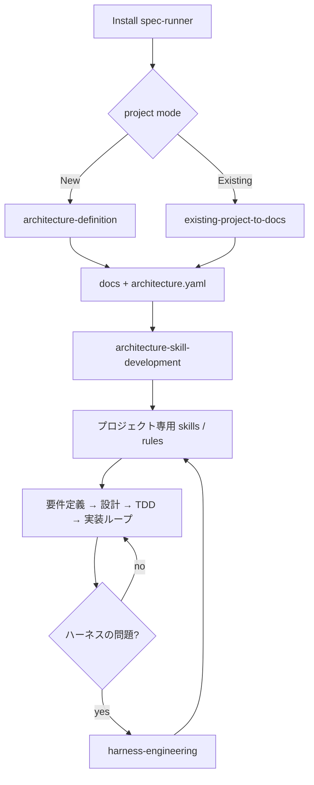

# spec-runner ハーネスエンジニアリング構想

## 整合性駆動開発とは

AI はコードを速く書く。速く書くほど設計書が腐る。設計書が腐ると、次の AI はコードを読んで設計を推測し始め、設計書はさらに腐る。この正のフィードバックループが、AI 時代のソフトウェア開発が直面する構造的な問題である。

**整合性駆動開発は「設計書とコードが常に一致していること」を不変条件として維持する開発手法である。**

docs 正本（設計書を先に書く）は手段であって目的ではない。目的は整合性の維持。整合性が保たれている限り、AI は設計書を読んで安全に実装できる。整合性が崩れた瞬間、AI は推測で動き始め、コードは設計から離れていく。

spec-runner はこの不変条件を機械的に強制するハーネスである。

---

## 不変条件の強制機構

整合性は宣言するだけでは維持できない。強制する仕組みが必要になる。

| 機構 | 何を強制するか |
|------|--------------|
| `maps_to` frontmatter | 設計書とコードの対応を宣言する。パス推測に頼らない |
| `scan.js` + hooks | `maps_to` の実在を Edit/Write のたびに検証する。存在しないパスがあれば exit 1 |
| `design-reviewer` エージェント | 責務・入出力・テスト観点の意味的整合を検証する |
| `design-change` のフェーズゲート | コードを先に変えることを構造的に防ぐ |
| `depends_on` frontmatter | 変更の波及範囲を設計書の依存関係として宣言する |

これらが組み合わさって「設計書とコードが一致している」という状態を継続的に強制する。

---

## なぜプロジェクト専用スキルが必要か

整合性はアーキテクチャに根ざしている。DDD のプロジェクトと CRUD のプロジェクトでは、設計の単位も、変更の波及経路も、テストの粒度も異なる。汎用スキルはそれを知らないため、AI は「正しいフロー」を提供できず、整合性の維持が形骸化する。

**固定の skill pack を配るのではなく、人間と AI が決めたアーキテクチャから、そのプロジェクト専用の skill を作る。** プロジェクト固有の構造を知ったスキルがあって初めて、整合性駆動開発は実務で機能する。

---

## docs / `.spec-runner/` の役割分担

### docs は人間向けの正本

```
docs/
├── 01_要件定義/
├── 02_概要設計/
│   ├── ユースケース/
│   └── 90_ADR/
└── 03_詳細設計/
    ├── src/**          ← src/ をミラー（主線）
    └── infrastructure/ ← 例外文書（必ず maps_to を付ける）
```

### `.spec-runner/` は AI 向けの補助情報

- `architecture/architecture.yaml` — アーキテクチャの設計契約
- `scan/graph.json` — 依存グラフのキャッシュ（hooks で自動生成）
- `scripts/scan.js` — graph.json を生成するスキャナー
- `intake/` — 既存プロジェクト解析の一時置き場

### frontmatter が整合性の宣言

```yaml
---
spec_runner:
  node_id: detail.src.agents.reconciliation.agent
  kind: detailed_design
  depends_on:
    - overview.system_context
    - overview.use_case_list
  maps_to:
    - src/agents/reconciliation/agent.py
    - tests/agents/reconciliation/test_agent.py
---
```

`maps_to` が設計書とコードをつなぐ唯一の正本。`scan.js` はこの宣言を検証し続ける。

---

## 全体フロー



---

## スキル一覧

### セットアップ系（初回のみ）

| スキル | 役割 |
|--------|------|
| `architecture-definition` | 新規プロジェクトの要件定義・概要設計・architecture contract 作成 |
| `existing-project-to-docs` | 既存コードから docs の draft を起こす |
| `architecture-skill-development` | architecture.yaml を読み、プロジェクト専用 skill / rule / template を作る |

### 開発ループ系

| スキル | 役割 |
|--------|------|
| `design-change` | 既存機能の変更を docs 正本で進める。影響調査 → ADR → 設計修正 → TDD |
| `test-driven-development` | テストを先に書く。実装前に必ず使う |
| `plugin-development` | プラグイン型アーキテクチャ向け reference workflow。専用スキル未整備の段階でも使える |
| `spec-probe` | 設計・要件の前提を一問一答で深掘りする |
| `commit` | コミットメッセージを生成する |

### シード系（`architecture-skill-development` が育てる種）

テンプレートとして同梱。`architecture-skill-development` がプロジェクトのアーキテクチャに合わせて専用スキルへ変換する。

| スキル | 対象 |
|--------|------|
| `ddd-seed` | `style: ddd` — ドメイン層（集約・値オブジェクト）を持つ設計フロー |
| `simple-seed` | `style: layered` — UC・サービス層中心のシンプルな設計フロー |

### ハーネス保守系

| スキル | 役割 |
|--------|------|
| `harness-engineering` | skills / rules / agents / templates 自体を改善・保守するメタスキル。繰り返し問題が起きたときだけ使う |

---

## エージェント一覧

メインエージェントから委任されるワーカー。読み取りと報告のみ行う。

| エージェント | 役割 | 起動タイミング |
|---|---|---|
| `@code-reviewer` | コーディング規約チェック（報告のみ） | 実装・修正完了後 |
| `@design-reviewer` | 設計書⇔実装の整合性チェック（報告のみ） | 設計書変更後・フェーズレビュー時 |
| `@test-runner` | テスト実行・失敗分析（報告のみ） | 実装・修正完了後 |

---

## ルール一覧

| ルール | 適用範囲 |
|--------|----------|
| `coding` | `src/`、`tests/` のコーディング規約（命名・型・コメント） |
| `design-docs` | `docs/` の frontmatter・命名・ADR・文書品質 |

---

## 依存グラフ（graph.json）

`docs/**/*.md` の frontmatter を静的解析し、`.spec-runner/scan/graph.json` にキャッシュする。Edit / Write のたびに `scan.js` が hooks で自動実行される。

```json
{
  "nodes": {
    "detail.src.agents.reconciliation.agent": {
      "file": "docs/03_詳細設計/src/agents/reconciliation/agent.md",
      "kind": "detailed_design",
      "depends_on": ["overview.system_context"],
      "maps_to": ["src/agents/reconciliation/agent.py"]
    }
  },
  "reverse_index": {
    "overview.system_context": ["detail.src.agents.reconciliation.agent"]
  },
  "missing_maps_to": []
}
```

`reverse_index` は「ある node_id を参照している文書の一覧」。`design-change` で影響ドキュメントを洗い出すときに使う。

`missing_maps_to` にパスが存在しなければ exit 1。`maps_to` の腐敗をコミット前に検知する。

---

## アーキテクチャ契約（architecture.yaml）

`architecture-definition` または `existing-project-to-docs` が作成し、`architecture-skill-development` が読み込む。

```yaml
architecture_name: example
style: ddd          # ddd | layered
has_frontend: false # true なら UC に画面レイアウトセクションを含める
domain_structure:   # ドメイン分割の方針
runtime_units:      # 実行単位（コンテナ、Lambda 等）
design_policy:      # 責務境界・実装単位の方針
testing_policy:
  unit: pytest
  integration: pytest
folder_structure:
  src: src/
  tests: tests/
```

`architecture-skill-development` はこのファイルを読み、シードスキルをプロジェクト専用スキルへ変換する。

---

## 初回自動起動

| 状態 | 判定方法 | 自動起動するスキル |
|------|---------|-----------------|
| 新規プロジェクト | `docs/` が存在しないか空 | `architecture-definition` |
| 既存プロジェクト | `docs/` にファイルがある | `existing-project-to-docs` |

どちらの場合も完了後に `architecture-skill-development` を続けて起動する。ユーザーにスラッシュコマンドを打たせない。
